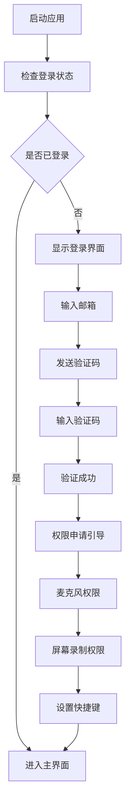
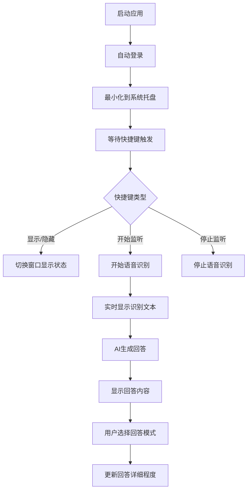

# AI面试助手桌面端功能交互设计

## 1. 用户流程设计

### 1.1 首次使用流程



### 1.2 日常使用流程



## 2. 界面交互设计

### 2.1 主窗口交互

```typescript
interface MainWindowInteractions {
  // 窗口控制
  minimize: () => void;           // 最小化窗口
  hide: () => void;              // 隐藏窗口
  toggleAlwaysOnTop: () => void; // 切换置顶状态

  // 透明度控制
  adjustOpacity: (value: number) => void; // 调整透明度 0-100

  // 语音控制
  startListening: () => void;    // 开始语音监听
  stopListening: () => void;     // 停止语音监听
  toggleListening: () => void;   // 切换监听状态

  // 回答模式
  setAnswerMode: (mode: 'simple' | 'normal' | 'detailed') => void;
}
```

### 2.2 快捷键交互

```typescript
interface ShortcutInteractions {
  // 默认快捷键
  'Cmd/Ctrl + Shift + H': '显示/隐藏主窗口';
  'Cmd/Ctrl + Shift + S': '开始/停止语音监听';
  'Cmd/Ctrl + Shift + 1': '切换到精简模式';
  'Cmd/Ctrl + Shift + 2': '切换到普通模式';
  'Cmd/Ctrl + Shift + 3': '切换到详细模式';
  'Cmd/Ctrl + Shift + Q': '快速退出应用';
  'Cmd/Ctrl + Shift + T': '切换透明度';

  // 自定义快捷键
  customShortcuts: Record<string, string>;
}
```

### 2.3 系统托盘交互

```typescript
interface TrayInteractions {
  // 右键菜单
  contextMenu: {
    show: () => void;           // 显示主窗口
    hide: () => void;           // 隐藏主窗口
    startListening: () => void; // 开始监听
    stopListening: () => void;  // 停止监听
    settings: () => void;       // 打开设置
    quit: () => void;          // 退出应用
  };

  // 左键点击
  leftClick: () => void; // 显示/隐藏主窗口

  // 状态指示
  updateIcon: (status: 'idle' | 'listening' | 'processing') => void;
}
```

## 3. 核心功能交互

### 3.1 语音识别交互

```typescript
interface VoiceInteraction {
  // 状态管理
  states: {
    idle: '待机状态';
    listening: '正在监听';
    processing: '处理中';
    responding: '生成回答中';
    error: '错误状态';
  };

  // 用户反馈
  visualFeedback: {
    microphoneIcon: '麦克风状态指示';
    volumeIndicator: '音量波形显示';
    recognitionText: '实时识别文本显示';
    processingSpinner: '处理中动画';
  };

  // 交互控制
  controls: {
    startButton: '开始监听按钮';
    stopButton: '停止监听按钮';
    clearButton: '清除当前内容';
    copyButton: '复制AI回答';
  };
}
```

### 3.2 屏幕共享躲避交互

```typescript
interface ScreenShareAvoidance {
  // 检测状态
  detectionStates: {
    normal: '正常状态';
    screenShareDetected: '检测到屏幕共享';
    hidden: '已隐藏状态';
  };

  // 躲避策略
  avoidanceStrategies: {
    completeHide: '完全隐藏窗口';
    transparentMode: '设置完全透明';
    minimizeToTray: '最小化到托盘';
    moveOffScreen: '移动到屏幕外';
  };

  // 用户控制
  userControls: {
    enableAutoHide: '启用自动隐藏';
    manualHide: '手动隐藏';
    emergencyHide: '紧急隐藏快捷键';
  };
}
```

### 3.3 设置界面交互

```typescript
interface SettingsInteraction {
  // 基础设置
  basicSettings: {
    opacity: {
      type: 'slider';
      range: [0, 100];
      default: 90;
      realTimePreview: true;
    };

    autoHide: {
      type: 'switch';
      default: true;
      description: '检测到屏幕共享时自动隐藏';
    };

    startWithSystem: {
      type: 'switch';
      default: false;
      description: '开机自动启动';
    };
  };

  // 音频设置
  audioSettings: {
    microphoneDevice: {
      type: 'select';
      options: 'dynamic'; // 动态获取可用设备
    };

    sensitivity: {
      type: 'slider';
      range: [1, 10];
      default: 5;
      testButton: true; // 提供测试按钮
    };

    noiseReduction: {
      type: 'switch';
      default: true;
    };
  };

  // 快捷键设置
  shortcutSettings: {
    shortcuts: Record<string, {
      key: string;
      editable: boolean;
      conflictCheck: boolean;
    }>;
  };

  // AI设置
  aiSettings: {
    responseMode: {
      type: 'radio';
      options: ['simple', 'normal', 'detailed'];
      default: 'normal';
    };

    responseSpeed: {
      type: 'slider';
      range: [1, 5];
      default: 3;
      description: '回答详细程度';
    };
  };
}
```

## 4. 错误处理交互

### 4.1 网络错误处理

```typescript
interface NetworkErrorHandling {
  // 连接失败
  connectionError: {
    message: '网络连接失败，请检查网络设置';
    actions: ['重试', '离线模式', '设置'];
    autoRetry: true;
    retryInterval: 5000; // 5秒后自动重试
  };

  // API调用失败
  apiError: {
    message: 'AI服务暂时不可用';
    actions: ['重试', '切换服务'];
    fallbackMode: '本地缓存回答';
  };

  // 认证失败
  authError: {
    message: '登录已过期，请重新登录';
    actions: ['重新登录', '退出'];
    autoRedirect: true;
  };
}
```

### 4.2 权限错误处理

```typescript
interface PermissionErrorHandling {
  // 麦克风权限
  microphonePermission: {
    denied: {
      message: '需要麦克风权限才能使用语音功能';
      actions: ['打开系统设置', '跳过'];
      guide: '详细的权限设置指南';
    };
  };

  // 屏幕录制权限
  screenRecordingPermission: {
    denied: {
      message: '需要屏幕录制权限来检测屏幕共享';
      actions: ['打开系统设置', '禁用此功能'];
      guide: 'macOS权限设置步骤';
    };
  };
}
```

## 5. 用户体验优化

### 5.1 首次使用引导

```typescript
interface OnboardingFlow {
  steps: [
    {
      title: '欢迎使用AI面试助手';
      content: '让我们快速设置您的专属面试助手';
      action: '开始设置';
    },
    {
      title: '权限设置';
      content: '我们需要一些权限来提供最佳体验';
      permissions: ['麦克风', '屏幕录制'];
    },
    {
      title: '快捷键设置';
      content: '设置您习惯的快捷键组合';
      customizable: true;
    },
    {
      title: '完成设置';
      content: '一切就绪！按 Cmd+Shift+H 可随时唤出助手';
      action: '开始使用';
    }
  ];
}
```

### 5.2 智能提示系统

```typescript
interface SmartTips {
  // 上下文提示
  contextualTips: {
    firstTimeListening: '点击麦克风图标开始语音识别';
    noMicrophoneDetected: '未检测到麦克风，请检查设备连接';
    screenShareDetected: '检测到屏幕共享，助手已自动隐藏';
    lowVolume: '音量较低，可能影响识别效果';
  };

  // 功能介绍
  featureTips: {
    transparencySlider: '拖动滑块调整窗口透明度';
    answerModes: '选择不同模式获得不同详细程度的回答';
    quickHide: '双击标题栏快速隐藏窗口';
  };
}
```

### 5.3 反馈机制

```typescript
interface FeedbackSystem {
  // 操作反馈
  operationFeedback: {
    success: {
      type: 'toast';
      duration: 2000;
      position: 'top-right';
    };

    error: {
      type: 'modal';
      closable: true;
      actions: ['重试', '取消'];
    };

    loading: {
      type: 'spinner';
      message: '处理中...';
      cancelable: true;
    };
  };

  // 状态指示
  statusIndicators: {
    listening: '脉动的麦克风图标';
    processing: '旋转的加载动画';
    hidden: '系统托盘图标变灰';
    error: '红色警告图标';
  };
}
```

## 6. 可访问性设计

### 6.1 键盘导航

```typescript
interface KeyboardNavigation {
  // Tab导航顺序
  tabOrder: [
    'startListeningButton',
    'answerModeSelector',
    'opacitySlider',
    'settingsButton',
    'minimizeButton'
  ];

  // 快捷键提示
  keyboardShortcuts: {
    showTooltips: true;
    highlightOnFocus: true;
    customizable: true;
  };
}
```

### 6.2 视觉辅助

```typescript
interface VisualAccessibility {
  // 高对比度模式
  highContrast: {
    enabled: boolean;
    autoDetect: true; // 检测系统设置
  };

  // 字体大小
  fontSize: {
    scalable: true;
    range: [12, 24];
    default: 14;
  };

  // 颜色指示
  colorBlindFriendly: {
    useShapes: true; // 使用形状辅助颜色
    alternativeIndicators: true;
  };
}
